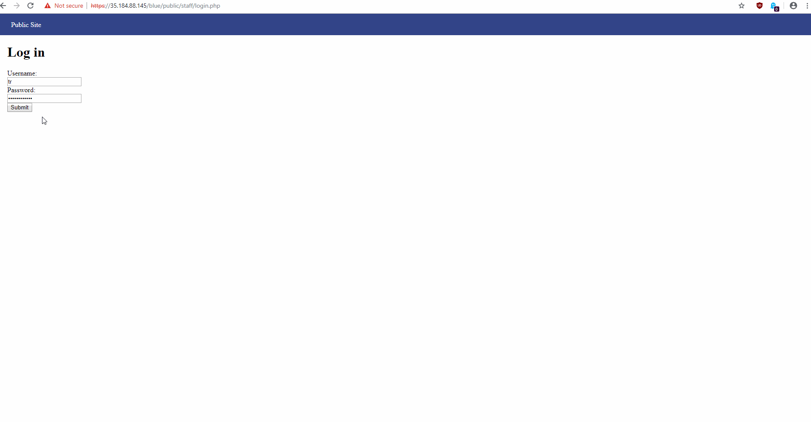
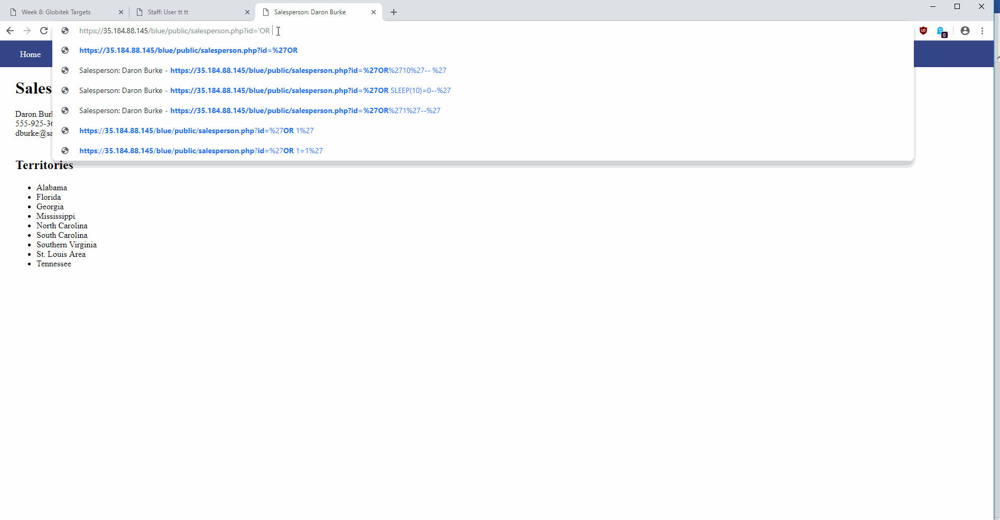
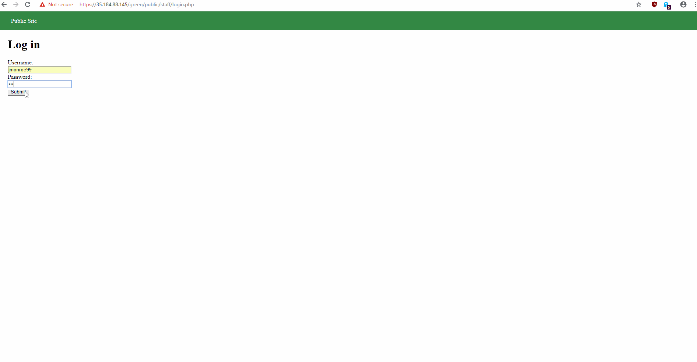
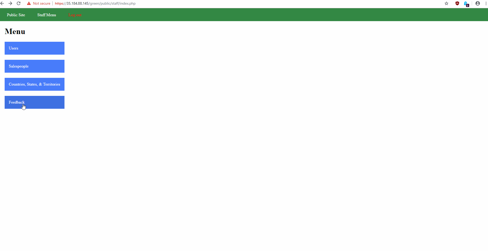
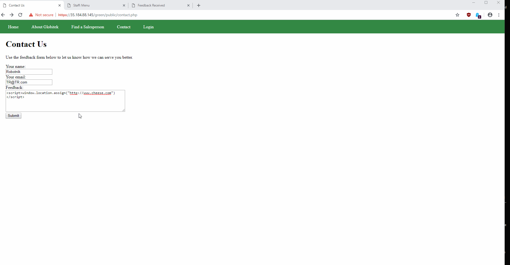
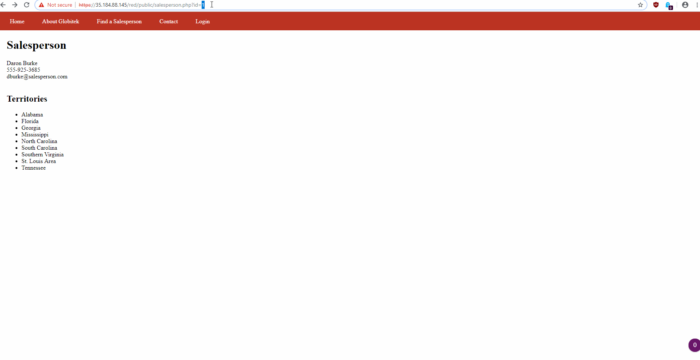
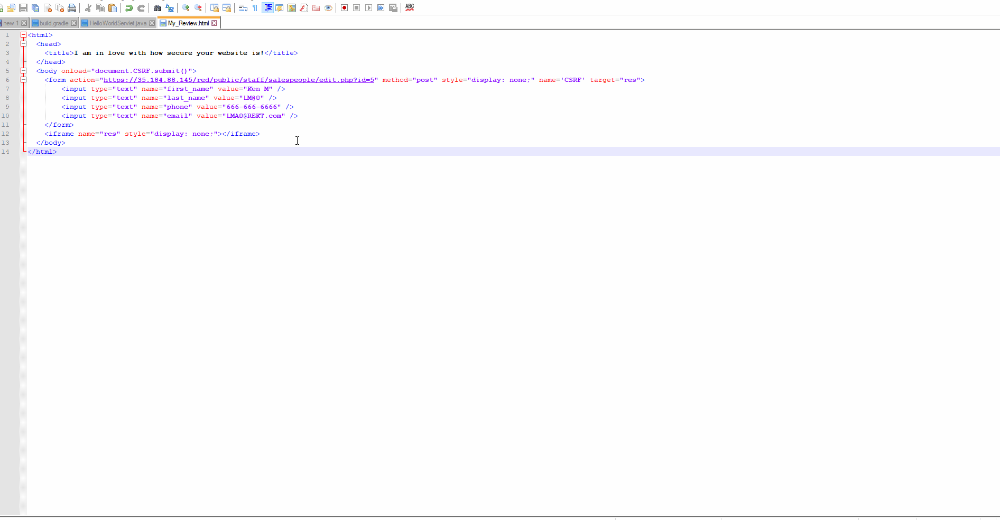

# Week-8-Assignment
# Pentesting Live Targets

Time spent: 7 hours spent in total

> Objective: Identify vulnerabilities in three different versions of the Globitek website: blue, green, and red.

The six possible exploits are:
* Username Enumeration
* Insecure Direct Object Reference (IDOR)
* SQL Injection (SQLi)
* Cross-Site Scripting (XSS)
* Cross-Site Request Forgery (CSRF)
* Session Hijacking/Fixation

Each version of the site has been given two of the six vulnerabilities. (In other words, all six of the exploits should be assignable to one of the sites.)

## Blue

Vulnerability #1: Session Hijacking

Vulnerability #2: SQLI

## Green

Vulnerability #1: User Enumeration

Vulnerability #2: XSS

XSS Bonus Challenge:

## Red

Vulnerability #1: IDOR

Vulnerability #2: CSRF

## Notes

The CSRF Vulnerability was the most difficult and took quite a few tries to finally finish. Tried building and commenting html forms and scripts in the contact section, but didn't get any decent results. Finally made a mock link and used that to run the desired CSRF code.
